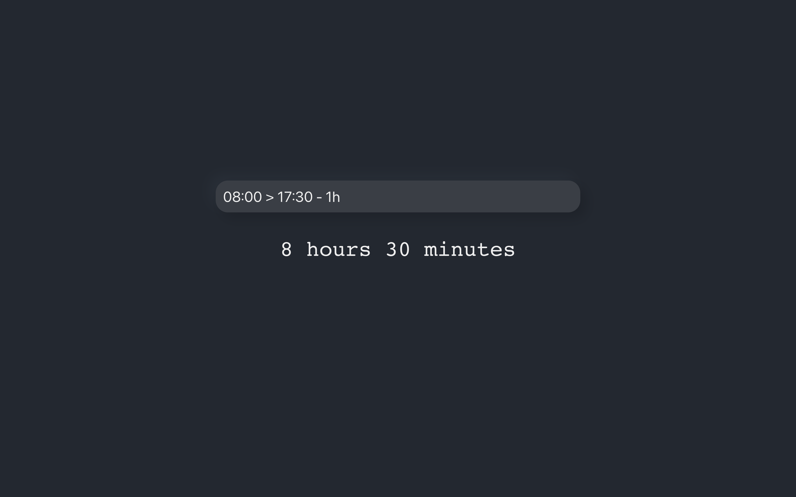

# Timecalculator

https://timecalculator.se/



## Examples

```shell
08:00 > 17:30         # 9 hours 30 minutes
```

```shell
08:00 + 8h30m1s       # 16:30:01
```

```shell
9h - (12:00 > 13:00)  # 8 hours
```
